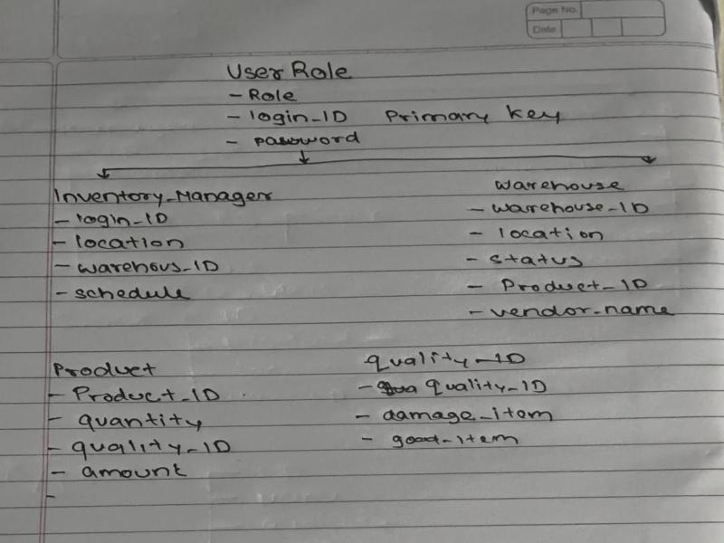

# StockMaster – Inventory Management System (IMS)

StockMaster is a modular Inventory Management System that digitizes and streamlines stock‑related operations within a business.  
It replaces manual registers and Excel sheets with a centralized, real‑time, easy‑to‑use web app.

---

## 🚀 Setup & Installation

This project uses two separate services that run concurrently:

- **Backend** – Node.js + Express + PostgreSQL
- **Frontend** – (e.g. React/Vite) SPA

### Prerequisites

- Node.js (v18+)
- npm (or yarn / pnpm)
- PostgreSQL database instance

---

## 1️⃣ Backend Setup

The backend handles all data storage, processing, and API endpoints.

> ✅ **Default backend port:** `5001`

### A. Environment Configuration

1. Go to the `backend` directory.
2. Create a `.env` file and configure the following variables:

```env
# Server Configuration
PORT=5001

# PostgreSQL Configuration
PGHOST=localhost
PGPORT=5432
PGDATABASE=stockmaster_db
PGUSER=your_db_user
PGPASSWORD=your_db_password
```

3. Install dependencies:

```bash
cd backend
npm install
```

4. Run database migrations / table creation scripts (for example):

```bash
npm run migrate
# or
node src/data/createTables.js
```

5. Start the backend server:

```bash
npm run dev
# or
npm start
```

---

## 2️⃣ Frontend Setup (Example: Vite + React)

If you want to keep frontend and backend in the **same root folder**, you can do:

```bash
# From project root
npm create vite@latest frontend
# Choose React + JavaScript template
cd frontend
npm install
npm run dev
```

Configure your frontend to call the backend APIs (for example):

```ts
const API_BASE_URL = "http://localhost:5001/api";
```

---

## 🗄 Database Design

The StockMaster system uses a relational **PostgreSQL** database.  
I designed the schema starting from **users and their roles**, then modeled how they interact with **warehouses** and **products**.

### 🧩 ER Diagram

The following diagram shows the high‑level design of the core tables used in StockMaster:



> The diagram connects **User Role → Inventory Manager → Warehouse → Product → Quality**.

---

### 1. Entity Overview

Main entities in the system:

- **UserRole** – who is using the system and with what permissions.
- **InventoryManager** – a specialized user responsible for a warehouse.
- **Warehouse** – physical storage location where stock is kept.
- **Product** – items being stored, counted, and moved.
- **Quality** – tracks the condition of products (good vs damaged quantity).

---

### 2. Tables and Columns

#### 2.1 `user_role`

Stores login credentials and the role of each user.

| Column     | Type       | Description                                          |
| ---------- | ---------- | ---------------------------------------------------- |
| `login_id` | VARCHAR PK | Unique ID for each user (primary key).               |
| `role`     | VARCHAR    | Role of the user (e.g. `Admin`, `InventoryManager`). |
| `password` | VARCHAR    | Hashed password for authentication.                  |

---

#### 2.2 `inventory_manager`

Represents inventory managers and links them to both a login and a warehouse.

| Column         | Type       | Description                                 |
| -------------- | ---------- | ------------------------------------------- |
| `id`           | SERIAL PK  | Internal unique identifier for the manager. |
| `login_id`     | VARCHAR FK | References `user_role.login_id`.            |
| `location`     | VARCHAR    | Base location / city of the manager.        |
| `warehouse_id` | INT FK     | References `warehouse.warehouse_id`.        |
| `schedule`     | VARCHAR    | Work schedule or shift information.         |

---

#### 2.3 `warehouse`

Each row represents a physical warehouse.

| Column         | Type      | Description                                        |
| -------------- | --------- | -------------------------------------------------- |
| `warehouse_id` | SERIAL PK | Unique ID of the warehouse.                        |
| `location`     | VARCHAR   | Address or area of the warehouse.                  |
| `status`       | VARCHAR   | Status (e.g. `Active`, `Inactive`, `Maintenance`). |
| `product_id`   | INT FK    | (Optional) points to a main product stored here.   |
| `vendor_name`  | VARCHAR   | Name of the vendor supplying this warehouse.       |

> 💡 In a more advanced version, product–warehouse relationships can be moved to a separate **stock** (junction) table to support many‑to‑many mapping. For this basic design, `product_id` is kept in `warehouse` to show a simple link.

---

#### 2.4 `product`

Represents a single product type in the system.

| Column       | Type      | Description                            |
| ------------ | --------- | -------------------------------------- |
| `product_id` | SERIAL PK | Unique ID of the product.              |
| `quantity`   | INT       | Current quantity for that product.     |
| `quality_id` | INT FK    | References `quality.quality_id`.       |
| `amount`     | NUMERIC   | Monetary value / price of the product. |

---

#### 2.5 `quality`

Tracks quality information (good vs damaged items) for a product.

| Column        | Type      | Description                   |
| ------------- | --------- | ----------------------------- |
| `quality_id`  | SERIAL PK | Unique ID for quality record. |
| `damage_item` | INT       | Number of damaged items.      |
| `good_item`   | INT       | Number of good/usable items.  |

---

### 3. Relationships Between Tables

- **UserRole → InventoryManager**  
  `inventory_manager.login_id` **FK** → `user_role.login_id`  
  Each inventory manager must be a valid user with a specific role.

- **InventoryManager → Warehouse**  
  `inventory_manager.warehouse_id` **FK** → `warehouse.warehouse_id`  
  Links managers to the warehouse they are responsible for.

- **Warehouse → Product**  
  `warehouse.product_id` **FK** → `product.product_id`  
  Shows which product is mainly associated with a warehouse (simple design).

- **Product → Quality**  
  `product.quality_id` **FK** → `quality.quality_id`  
  Connects a product to its quality details (good vs damaged items).

---

### 4. Sample PostgreSQL Schema (DDL)

Below is an example of how this design can be implemented in PostgreSQL:

```sql
-- 1. User Role
CREATE TABLE user_role (
  login_id   VARCHAR(100) PRIMARY KEY,
  role       VARCHAR(50) NOT NULL,
  password   VARCHAR(255) NOT NULL
);

-- 2. Warehouse
CREATE TABLE warehouse (
  warehouse_id SERIAL PRIMARY KEY,
  location     VARCHAR(255) NOT NULL,
  status       VARCHAR(50)  NOT NULL,
  product_id   INT,
  vendor_name  VARCHAR(255)
);

-- 3. Quality
CREATE TABLE quality (
  quality_id   SERIAL PRIMARY KEY,
  damage_item  INT DEFAULT 0,
  good_item    INT DEFAULT 0
);

-- 4. Product
CREATE TABLE product (
  product_id  SERIAL PRIMARY KEY,
  quantity    INT NOT NULL,
  quality_id  INT REFERENCES quality(quality_id),
  amount      NUMERIC(10,2) NOT NULL
);

-- 5. Inventory Manager
CREATE TABLE inventory_manager (
  id           SERIAL PRIMARY KEY,
  login_id     VARCHAR(100) REFERENCES user_role(login_id),
  location     VARCHAR(255),
  warehouse_id INT REFERENCES warehouse(warehouse_id),
  schedule     VARCHAR(255)
);
```

---

### 5. Design Rationale – How I Designed It

1. **Started from users and roles**  
   I first created a `user_role` table so authentication and authorization are centralized.

2. **Separated responsibilities**  
   Inventory managers have extra attributes (warehouse and schedule), so I created a dedicated `inventory_manager` table linked back to `user_role`.

3. **Modeled physical storage**  
   The `warehouse` table represents real‑world locations where items are stored.

4. **Modeled products and their condition**  
   The `product` table stores quantity and price, while `quality` tracks how many items are in good or damaged condition.

5. **Connected everything using foreign keys**  
   Foreign key relationships ensure data consistency and clearly show how users, managers, warehouses, and products are related inside the system.

---
